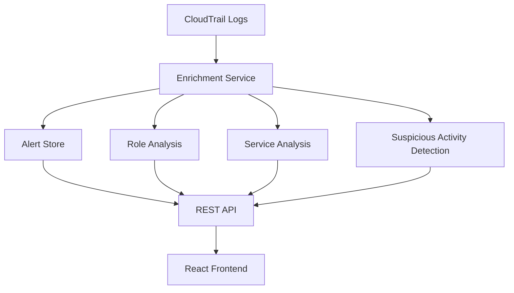

# AWS Alert Enrichment Workbench

A simplified version of an alert enrichment system inspired by Expel's approach to AWS security monitoring. This tool helps security analysts quickly investigate AWS CloudTrail alerts by automatically providing context and enrichment data.


## Project Overview

Security analysts often need to investigate AWS alerts by manually digging through CloudTrail logs to understand:

- Who assumed what roles?
- What services did they access?
- Were there any suspicious API calls?
- Is this normal behavior for this user?

This tool automates that process by:

1. Processing CloudTrail logs to extract meaningful patterns
2. Automatically enriching alerts with relevant context
3. Presenting the data in an intuitive dashboard

## Key Features

### 1. Role Assumption Tracking

- Automatically tracks IAM role assumptions
- Detects federated access (AWS SSO/SAML)
- Identifies failed role assumption attempts
- Shows role assumption chains

### 2. Service Interaction Analysis

- Visualizes which AWS services were accessed
- Shows interaction frequency over time
- Highlights unusual service access patterns

### 3. Suspicious Activity Detection

- Identifies non-read operations (Create*, Delete*, Modify\*)
- Tracks failed API calls
- Highlights potential privilege escalation
- Compares against historical patterns

### 4. Interactive Dashboard

- Alert list with severity indicators
- Detailed enrichment views
- Service usage visualization
- Timeline of suspicious activities

## Technical Stack

### Backend (Python/Flask)

- Event processing and enrichment logic
- CloudTrail log analysis
- REST API for frontend
- Mock data generation for testing

### Frontend (React)

- Interactive dashboard
- Data visualization using recharts
- Component library from shadcn/ui
- Responsive design

## Quick Start

1. Generate test data:

```bash
python mock_cloudtrail.py
```

2. Start the backend:

```bash
pip install flask flask-cors
python enrichment_backend.py
```

3. Run the frontend:

```bash
npm install
npm run dev
```

## Architecture



## Design Decisions

1. **Modular Enrichments**

   - Each enrichment type is independent
   - Easy to add new enrichment types
   - Configurable processing rules

2. **Alert-Centric Design**

   - Alerts are first-class citizens
   - Each alert maintains its context
   - Enrichments linked to specific alerts

## Missing Features

1. **Implementing real CloudTrail integration**
2. **Moving to an event-driven architecture**
3. **Adding proper security controls**
4. **Implementing proper testing**

## Future Enhancements

1. **Enhanced Detection**

   - Machine learning for anomaly detection
   - More sophisticated pattern matching
   - Custom rule engine

2. **Additional Enrichments**

   - Resource access patterns
   - Network activity analysis
   - Cost impact assessment

3. **Advanced Visualization**
   - Graph visualization for role chains
   - Advanced filtering and search
   - Custom dashboards

## Development

- Uses mock data generator for testing
- Includes sample suspicious patterns
- Easy to extend with new enrichment types
- Well-documented codebase

## Contributing

Feel free to submit issues and enhancement requests!

## License

This project is licensed under the MIT License - see the LICENSE file for details.

---

_Note: This is a simplified version built for demonstration. A production system would include additional features like authentication, robust error handling, and more sophisticated analysis capabilities._
